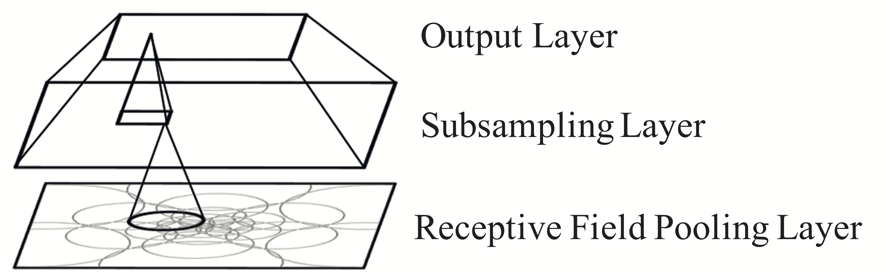

# rf_pool
Perform pooling across receptive fields of different sizes and locations in
convolutional neural networks (CNNs).

This package allows users to perform various pooling operations within receptive
fields tiling the output of a convolutional layer. Whereas typical max-pooling
operations occur in blocks of pixels (e.g., 2x2 MaxPool), rf-pooling occurs
within individual receptive fields covering variable areas of the image space.
Various initializations for the receptive field array are available including
uniform, foveated, and tiled. Furthermore, rf_pool supports building models
with feedforward or Restricted Boltzmann Machine (RBM) layers among a variety
of other options.

## Setup
After downloading, run the following from command line:

    $ cd rf_pool
    $ pip install -r requirements.txt
    $ pip install -e .
    $ python -m unittest discover tests

Note: rf_pool requires python version >= 3.6. If tests fail, try using a conda environment during install:

    $ cd rf_pool
    $ conda create -n rf_pool python=3.6
    $ conda activate rf_pool
    $ pip install -r requirements.txt
    $ pip install -e .
    $ python -m unittest discover tests

## Example
After installing, run the following from command line to train on MNIST:

    $ python rf_pool/scripts/train.py --config examples/mnist_example.yaml --max_epochs 1

## Demos
Open a jupyter notebook, and begin exploring the notebooks in the "example" folder.
These notebooks cover most of the typical cases for using rf_pool.

## Experiments
Experiments from our lab that have used rf_pool are hosted in the "experiments" folder.
